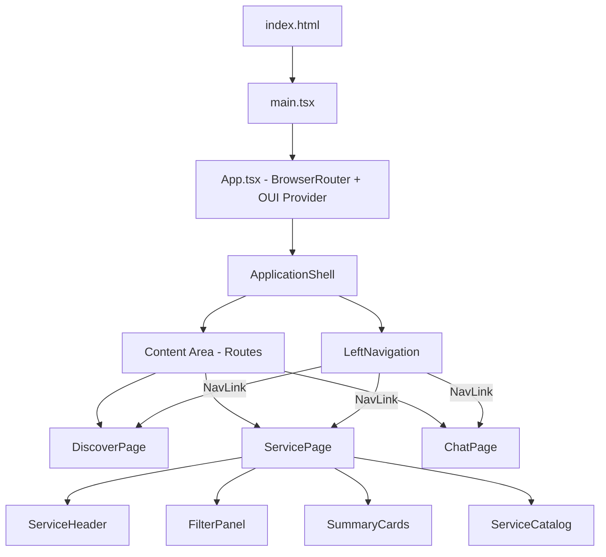
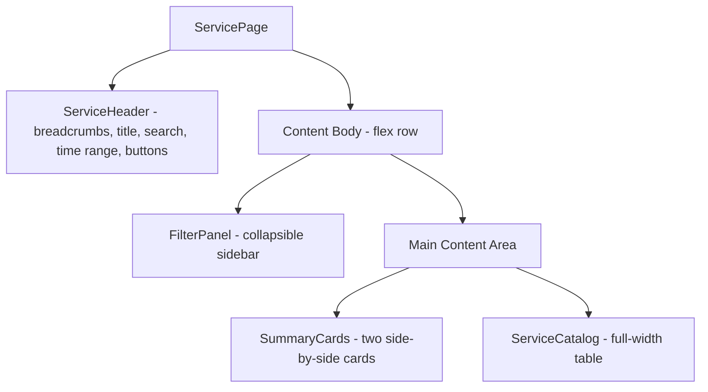
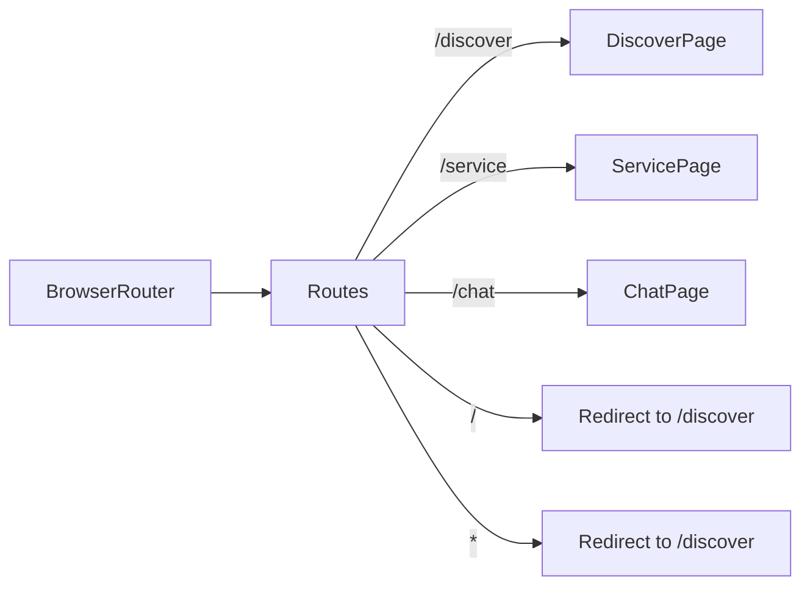
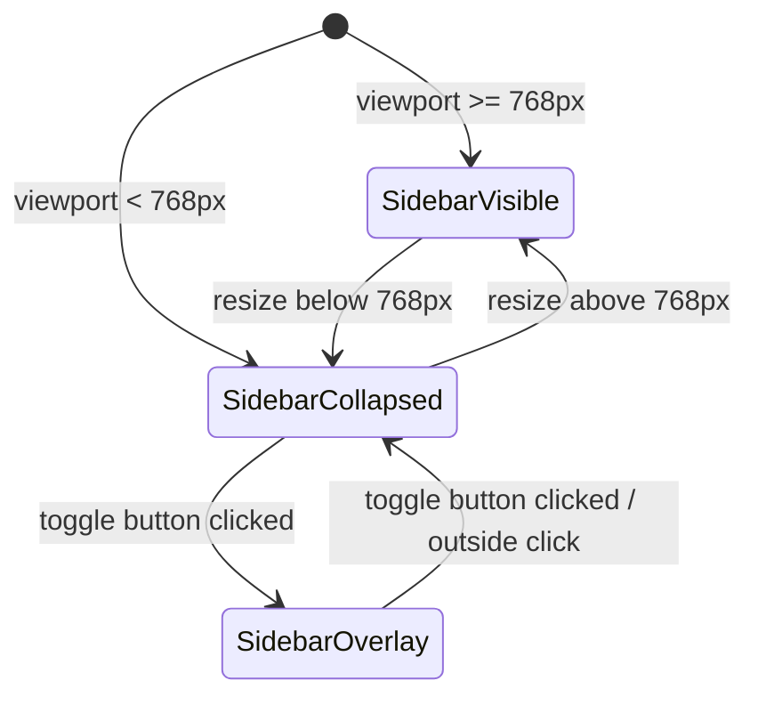

# Design Document: OpenSearch Dashboards Next

## Overview

OpenSearch Dashboards Next is a greenfield React application that serves as a proof-of-concept rebuild of the OpenSearch Dashboards frontend. It integrates the OUI v9 design system from the `v9-rework` branch of `kamingleung/oui-next` to validate the new component library in a realistic application shell.

The application consists of:
- An **Application Shell** with a persistent left navigation sidebar (OUI v9 pattern) and a routed content area
- **Three sample pages**: Discover (data exploration), Service (APM Observability), and Chat (conversational AI)
- The **Service page** is a detailed APM Observability view with a header bar, collapsible filter panel, summary cards, and a sortable service catalog table
- **Client-side routing** via React Router for SPA navigation
- **Responsive layout** that collapses the sidebar on viewports narrower than 768px

### Key Design Decisions

| Decision | Choice | Rationale |
|---|---|---|
| Framework | React 18+ with TypeScript | Industry standard, aligns with existing OSD ecosystem |
| Routing | React Router v6 | Mature client-side routing with nested route support |
| Design System | OUI v9 (`v9-rework` branch) | Required by project scope; provides tokens, components, layout primitives |
| Build Tool | Vite | Fast HMR, native ESM, minimal config for React+TS |
| Styling | OUI v9 theme + CSS modules for overrides | Leverage design system tokens; scoped overrides where needed |
| Service Page State | Local React state with sample data | No backend; filter/sort state managed in-page via useState/useReducer |

## Architecture



### Service Page Layout



### Routing Architecture



### Responsive Behavior



## Components and Interfaces

### Component Tree

```
App
├── OuiProvider (OUI v9 theme context)
└── BrowserRouter
    └── ApplicationShell
        ├── LeftNavigation
        │   ├── Logo (OpenSearch logo)
        │   ├── CollapseToggle
        │   ├── NavSearchInput (decorative)
        │   ├── NavItem (Discover)
        │   ├── NavItem (Service)
        │   ├── NavItem (Chat)
        │   └── BottomIconBar
        └── ContentArea
            └── <Routes>
                ├── DiscoverPage
                ├── ServicePage
                │   ├── ServiceHeader
                │   ├── FilterPanel
                │   │   ├── EnvironmentSection
                │   │   ├── LatencySection
                │   │   ├── ThroughputSection
                │   │   ├── FailureRatioSection
                │   │   └── AttributesSection
                │   ├── SummaryCards
                │   │   ├── TopServicesByFaultRate
                │   │   └── TopDependencyPathsByFaultRate
                │   └── ServiceCatalog
                └── ChatPage
```

### Component Interfaces

#### `App` (root)
- Wraps the entire application in `OuiProvider` and `BrowserRouter`
- No props

#### `ApplicationShell`
- Renders `LeftNavigation` and the routed content area side by side
- Manages sidebar visibility state for responsive behavior

```typescript
interface ApplicationShellState {
  isSidebarOpen: boolean;
}
```

#### `LeftNavigation`
- Renders the OpenSearch logo, collapse/expand toggle, decorative search input, exactly three nav items, and a bottom icon bar
- Highlights the currently active route with a blue background
- On small viewports, renders as an overlay when toggled open

```typescript
interface LeftNavigationProps {
  isOpen: boolean;
  onToggle: () => void;
}

interface NavItemConfig {
  label: string;   // "Discover" | "Service" | "Chat"
  path: string;    // "/discover" | "/service" | "/chat"
  icon: string;    // OUI icon name
}
```

#### `DiscoverPage`
- Renders page title "Discover" and placeholder data exploration content
- Uses OUI v9 layout and typography components
- Props: none

#### `ServicePage`
- Orchestrates the Service page layout: ServiceHeader at top, then a flex row with FilterPanel on the left and main content (SummaryCards + ServiceCatalog) on the right
- Manages filter state and passes it down to child components

```typescript
interface ServicePageState {
  filters: FilterState;
  latencyTab: 'P99' | 'P90' | 'P50';
  sortColumn: string | null;
  sortDirection: 'asc' | 'desc';
}
```

#### `ServiceHeader`
- Renders breadcrumbs ("APM Observability /"), page title "Services", search filter input, time range selector, Refresh button, and APM Settings button

```typescript
interface ServiceHeaderProps {
  searchValue: string;
  onSearchChange: (value: string) => void;
}
```

#### `FilterPanel`
- Collapsible sidebar with five filter sections: Environment, Latency, Throughput, Failure Ratio, Attributes
- Each section is independently collapsible via its header

```typescript
interface FilterPanelProps {
  filters: FilterState;
  onFilterChange: (filters: FilterState) => void;
}

interface FilterState {
  environments: Record<string, boolean>; // generic, EKS, ECS, EC2, Lambda
  latencyRange: [number, number];        // min 4, max 443 (ms)
  throughputRange: [number, number];     // min 8, max 310 (req/int)
  attributes: Record<string, boolean>;   // cpp, dotnet, go, nodejs, python
}

interface CollapsibleSectionState {
  environment: boolean;
  latency: boolean;
  throughput: boolean;
  failureRatio: boolean;
  attributes: boolean;
}
```

#### `SummaryCards`
- Renders two side-by-side cards above the ServiceCatalog

```typescript
interface SummaryCardsProps {
  topServicesByFaultRate: FaultRateEntry[];
  topDependencyPaths: DependencyPathEntry[];
}
```

#### `ServiceCatalog`
- Full-width sortable table with latency tab toggle (P99/P90/P50), pagination, and sparkline charts

```typescript
interface ServiceCatalogProps {
  services: ServiceEntry[];
  activeLatencyTab: 'P99' | 'P90' | 'P50';
  onLatencyTabChange: (tab: 'P99' | 'P90' | 'P50') => void;
  sortColumn: string | null;
  sortDirection: 'asc' | 'desc';
  onSort: (column: string) => void;
}
```

#### `ChatPage`
- Renders page title "Chat" and placeholder conversational interface with message area and input field
- Uses OUI v9 layout and typography components
- Props: none

### Route Configuration

```typescript
const NAV_ITEMS: NavItemConfig[] = [
  { label: "Discover", path: "/discover", icon: "discoverApp" },
  { label: "Service", path: "/service", icon: "monitoringApp" },
  { label: "Chat", path: "/chat", icon: "chatApp" },
];

const routes = [
  { path: "/discover", element: <DiscoverPage /> },
  { path: "/service", element: <ServicePage /> },
  { path: "/chat", element: <ChatPage /> },
  { path: "/", element: <Navigate to="/discover" replace /> },
  { path: "*", element: <Navigate to="/discover" replace /> },
];
```

## Data Models

### Navigation Item Model

```typescript
interface NavItemConfig {
  label: string;  // Display text for the nav item
  path: string;   // URL path the item routes to
  icon: string;   // OUI icon identifier
}
```

### Application Shell State

```typescript
interface ShellState {
  isSidebarOpen: boolean;
}
```

### Filter State

```typescript
interface FilterState {
  environments: Record<string, boolean>;
  latencyRange: [number, number];
  throughputRange: [number, number];
  attributes: Record<string, boolean>;
}

const DEFAULT_FILTER_STATE: FilterState = {
  environments: { generic: true, EKS: true, ECS: true, EC2: true, Lambda: true },
  latencyRange: [4, 443],
  throughputRange: [8, 310],
  attributes: { cpp: true, dotnet: true, go: true, nodejs: true, python: true },
};
```

### Service Data Models

```typescript
type ServiceStatus = 'healthy' | 'warning' | 'critical';

interface ServiceEntry {
  name: string;
  status: ServiceStatus;           // maps to colored dot: green, orange, red
  correlationsAvailable: boolean;
  avgLatencyP99: number;
  avgLatencyP90: number;
  avgLatencyP50: number;
  latencySparkline: number[];      // array of values for sparkline chart
  avgThroughput: number;
  throughputSparkline: number[];
  avgFailureRatio: number;         // percentage 0-100
  failureRatioSparkline: number[];
  environment: string;
}

interface FaultRateEntry {
  serviceName: string;
  faultRate: number;               // percentage 0-100
}

interface DependencyPathEntry {
  dependencyService: string;
  service: string;
  faultRate: number;               // percentage 0-100
}
```

### Failure Ratio Legend

```typescript
interface FailureRatioLegendItem {
  label: string;
  color: string;
  condition: string;
}

const FAILURE_RATIO_LEGEND: FailureRatioLegendItem[] = [
  { label: '< 1%', color: 'blue', condition: 'ratio < 1' },
  { label: '1-5%', color: 'orange', condition: '1 <= ratio <= 5' },
  { label: '> 5%', color: 'red', condition: 'ratio > 5' },
];
```

### Route Map

| Path | Component | Default? |
|---|---|---|
| `/discover` | `DiscoverPage` | Yes (redirect target for `/` and `*`) |
| `/service` | `ServicePage` | No |
| `/chat` | `ChatPage` | No |

### Sample Data

The Service page uses hardcoded sample data arrays (8 `ServiceEntry` rows, 4 `FaultRateEntry` rows, 4 `DependencyPathEntry` rows) defined in a `sampleData.ts` module. No backend or API calls are involved.

## Correctness Properties

*A property is a characteristic or behavior that should hold true across all valid executions of a system — essentially, a formal statement about what the system should do. Properties serve as the bridge between human-readable specifications and machine-verifiable correctness guarantees.*

### Property 1: Navigation items are exactly Discover, Service, Chat

*For any* rendering of the LeftNavigation component, the navigation should contain exactly three items with labels "Discover", "Service", and "Chat" — no more, no fewer.

**Validates: Requirements 3.5, 3.6**

### Property 2: Navigation click routes correctly

*For any* navigation item in the LeftNavigation, clicking that item should change the current route to the item's corresponding path, and the matching page component should render in the content area — without a full page reload.

**Validates: Requirements 3.7**

### Property 3: Active route highlights the correct nav item

*For any* route that maps to a sample page, the LeftNavigation should visually mark exactly one navigation item as active, and that item's path should match the current route.

**Validates: Requirements 3.8**

### Property 4: Undefined paths redirect to Discover

*For any* URL path that is not one of `/discover`, `/service`, or `/chat`, the router should redirect to `/discover` and render the DiscoverPage.

**Validates: Requirements 4.5**

### Property 5: Filter panel sections toggle on click

*For any* collapsible section in the FilterPanel (Environment, Latency, Throughput, Failure Ratio, Attributes), clicking the section header should toggle the visibility of that section's content. If the section was expanded, it becomes collapsed, and vice versa.

**Validates: Requirements 7.9**

### Property 6: Sortable columns sort the service catalog

*For any* sortable column in the ServiceCatalog table, clicking that column header should sort the table rows by that column's values. Clicking the same column again should reverse the sort direction.

**Validates: Requirements 9.7**

### Property 7: Sidebar visibility follows viewport width threshold

*For any* viewport width, the LeftNavigation sidebar should be visible if and only if the width is 768 pixels or greater. When the width is below 768 pixels, the sidebar should be collapsed/hidden.

**Validates: Requirements 11.1, 11.2**

## Error Handling

| Scenario | Handling Strategy |
|---|---|
| Unknown route | Catch-all route (`*`) redirects to `/discover` (Req 4.5) |
| OUI v9 component render failure | React Error Boundary at the `ApplicationShell` level catches and displays a fallback UI |
| Missing OUI v9 dependency | Build-time failure; CI pipeline catches this before deployment |
| Navigation state desync | Sidebar open/close state is local React state; no persistence needed |
| Filter state invalid range | Clamp slider values to defined min/max bounds (Latency: 4–443ms, Throughput: 8–310 req/int) |
| Sort on empty data | ServiceCatalog renders empty state; sort is a no-op on empty arrays |

### Error Boundary

The `ApplicationShell` wraps the content area in a React Error Boundary. If a page component throws during render, the boundary displays a simple error message with a link back to `/discover` rather than crashing the entire shell.

## Testing Strategy

### Testing Framework

- **Unit / Component Tests**: Vitest + React Testing Library
- **Property-Based Tests**: fast-check (integrated with Vitest)
- **Test Runner**: Vitest (single execution via `vitest --run`)

### Unit Tests

Unit tests cover specific examples, edge cases, and integration points:

- **LeftNavigation renders OpenSearch logo, collapse toggle, decorative search input, and bottom icon bar** (Req 3.1, 3.2, 3.3, 3.9)
- **Nav search input is decorative (no state change on interaction)** (Req 3.4)
- **Route `/discover` renders DiscoverPage with title "Discover"** (Req 4.1, 5.1)
- **Route `/service` renders ServicePage with breadcrumb "APM Observability /"** (Req 4.2, 6.1)
- **Route `/chat` renders ChatPage with title "Chat"** (Req 4.3, 10.1)
- **Root path `/` redirects to `/discover`** (Req 4.4)
- **ApplicationShell renders LeftNavigation and content area on load** (Req 2.1, 2.2, 2.3)
- **ServiceHeader renders search input, time range selector, Refresh button, APM Settings button** (Req 6.2–6.6)
- **FilterPanel renders all five sections with correct controls** (Req 7.1–7.8)
- **FilterPanel Attributes section has "Select all" and "Clear all" links** (Req 7.8)
- **SummaryCards renders two cards with correct titles and row counts** (Req 8.1–8.5)
- **ServiceCatalog renders with P99 tab active by default** (Req 9.3)
- **ServiceCatalog displays all required columns** (Req 9.4)
- **ServiceCatalog displays 8 rows of sample data** (Req 9.5)
- **ServiceCatalog displays pagination controls with "Rows per page: 10"** (Req 9.6)
- **ChatPage renders message area and input field** (Req 10.3)
- **Sidebar toggle button appears when viewport < 768px** (Req 11.3)

### Property-Based Tests

Each property test uses `fast-check` with a minimum of 100 iterations and references its design property.

- **Feature: opensearch-dashboards-next, Property 1: Navigation items are exactly Discover, Service, Chat**
  Render the LeftNavigation in various states (open/closed). Assert exactly 3 nav items with the correct labels are always present.

- **Feature: opensearch-dashboards-next, Property 2: Navigation click routes correctly**
  Generate a random selection from the nav items array. Simulate a click on that nav item. Assert the route matches the item's path and the correct page component is rendered.

- **Feature: opensearch-dashboards-next, Property 3: Active route highlights the correct nav item**
  Generate a random route from the defined routes. Navigate to it. Assert exactly one nav item has the active indicator and its path matches the current route.

- **Feature: opensearch-dashboards-next, Property 4: Undefined paths redirect to Discover**
  Generate arbitrary path strings that are not `/discover`, `/service`, or `/chat`. Navigate to each. Assert the application redirects to `/discover` and renders DiscoverPage.

- **Feature: opensearch-dashboards-next, Property 5: Filter panel sections toggle on click**
  Generate a random sequence of section identifiers (Environment, Latency, Throughput, Failure Ratio, Attributes) and toggle actions. For each action, click the section header and assert the section content visibility has toggled from its previous state.

- **Feature: opensearch-dashboards-next, Property 6: Sortable columns sort the service catalog**
  Generate a random sortable column and a random set of service data. Click the column header. Assert the resulting row order matches the expected sort order for that column's values.

- **Feature: opensearch-dashboards-next, Property 7: Sidebar visibility follows viewport width threshold**
  Generate random viewport widths (e.g., 320–1920). For each width, resize the viewport and assert sidebar visibility equals `(width >= 768)`.

### Test Configuration

```typescript
// vitest.config.ts
import { defineConfig } from 'vitest/config';

export default defineConfig({
  test: {
    environment: 'jsdom',
    globals: true,
    setupFiles: ['./src/test/setup.ts'],
  },
});
```

Each property-based test must:
1. Use `fc.assert(fc.property(...))` from fast-check
2. Run a minimum of 100 iterations (`{ numRuns: 100 }`)
3. Include a comment tag: `// Feature: opensearch-dashboards-next, Property N: <title>`
